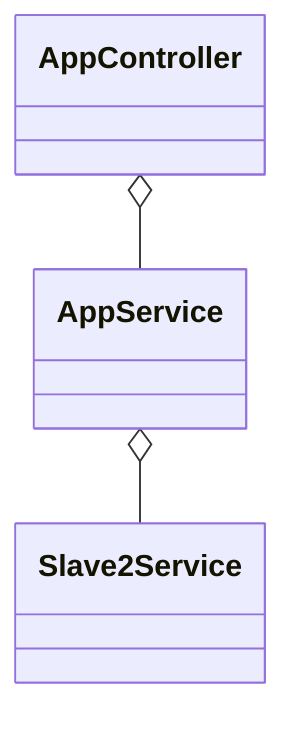
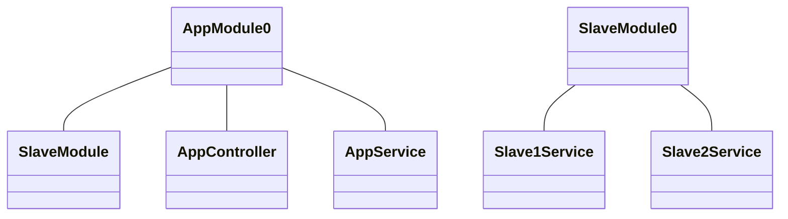

[Nest LifeCycle 알아보기](https://snow-chestnut-45b.notion.site/Lifecycle-events-0f3ae22455d1421c90c19a634b247c99)

# ☀️ 언제 쓰는데?

---

- NestJS 컴포넌트의 LifeCycle을 Hooking 하고 싶을 때 사용한다.
- 컴포넌트의 비동기 Init()을 처리할 때 사용한다.


**initializing**, **running**, **terminationg** 세 단계로 분류한다.

| 수명 주기 후크 방법 | 후크 메서드 호출을 트리거하는 수명 주기 이벤트 |
| --- | --- |
| onModuleInit() | 호스트(자신을 선언한) 모듈의 종속성이 해결되면 호출됨. |
| onApplicationBootstrap() | 모든 모듈이 초기화된 후 호출 됨. (connection listening 전) |
| onModuleDestroy() | 종료 신호(예: SIGTERM, SIGINT)가 수신된 후 호출됨. |
| beforeApplicationShutdown() | 모든 onModuleDestroy()처리기가 완료된 후 호출됨. 완료되면 모든 connection이 닫힘. |
| onApplicationShutdown() | connection 종료 후 호출됨. |

# 🛠️ 사용법

---

## 🆕 어플리케이션 실행 후킹하는 경우

```tsx
import { Injectable, OnModuleInit } from '@nestjs/common';

@Injectable()
export class UsersService implements OnModuleInit {
  onModuleInit() {
    console.log(`The module has been initialized.`);
  }
	
	// 아래처럼 
	async onModuleInit(): Promise<void> {
	  await this.fetch();
	}
}

```

> 타입스크립트는 컴파일 후 javascript로 변활될 때 interface는 사라지므로 implements 문을 작성하지 않아도 된다. 그럼에도 불구하고 타입 타이핑으로 인한 이점을 얻으려면 사용하는 것을 추천한다.
>

후킹함수를 비동기 메서드로 만들어 async initializer로 사용할 수 있다.

## 🔚 어플리케이션 종료 후킹하는 경우

```tsx
import { NestFactory } from '@nestjs/core';
import { AppModule } from './app.module';

async function bootstrap() {
  const app = await NestFactory.create(AppModule);

  // Starts listening for shutdown hooks
  app.enableShutdownHooks();

  await app.listen(3000);
}
bootstrap();
```

`onModuleDestroy()`, `beforeApplicationShutDown()` 훅은 종료 단계에서 호출되는데, 시스템 종료는 SIGINT(Ctrl + C)이나 쿠버네티스 컨테이너 등에서 `app.close()` 로 종료 단계가 시작된다.

디폴트로 훅 리시버는 비활성화 되어있으므로, 사용하고 싶다면 `enableShutDownHooks()` 를 실행하여 활성화 해야한다. (훅 리시버가 활성화되면 app이 종료되더라도 메모리를 소비하므로…)

```tsx
@Injectable()
class UsersService implements OnApplicationShutdown {
  onApplicationShutdown(signal: string) {
    console.log(signal); // e.g. "SIGINT"
  }
}
```

# 🔬 실험실

---

## 1. 모듈간의 LifeCycle hook 순서 확인하기

### Test용 NestJS App의 구성도

**컴포넌트 간 의존성 표현**



**각 모듈의 표현**



### 작성한 코드

**app.module.ts**

```tsx
@Module({
  imports: [SlaveModule],
  controllers: [AppController],
  providers: [AppService],
})
export class AppModule {
  id = 'AppModule';
  constructor() {
    console.log('constructor', this.id);
  }
}
```

**app.controller.ts**

```tsx
@Controller()
export class AppController
  implements
    OnModuleInit,
    OnApplicationBootstrap,
    OnModuleDestroy,
    BeforeApplicationShutdown,
    OnApplicationShutdown
/* implements 구현 */
```

**app.service.ts**

```tsx
@Injectable()
export class AppService
  implements
    OnModuleInit,
    OnApplicationBootstrap,
    OnModuleDestroy,
    BeforeApplicationShutdown,
    OnApplicationShutdown
{
  id = 'AppService';
  constructor(private readonly slave2service: Slave2Service) {
    console.log('constructor', this.id);
  }
  onModuleInit(): any {
    console.log('onModuleInit', this.id);
  }
  onApplicationBootstrap(): any {
    console.log('onApplicationBootstrap', this.id);
  }
  onModuleDestroy(): any {
    console.log('onModuleDestroy', this.id);
  }
  beforeApplicationShutdown(signal?: string): any {
    console.log('beforeApplicationShutdown', this.id);
  }
  onApplicationShutdown(signal?: string): any {
    console.log('onApplicationShutdown', this.id);
  }
}
```

**slave.module.ts**

```tsx
@Module({
  imports: [],
  controllers: [],
  providers: [Slave1Service, Slave2Service],
  exports: [Slave1Service, Slave2Service],
})
export class SlaveModule
  implements
    OnModuleInit,
    OnApplicationBootstrap,
    OnModuleDestroy,
    BeforeApplicationShutdown,
    OnApplicationShutdown
{
/* implements 구현 */
```

**slave1.service.ts, slave2.service.ts**

```tsx
export class Slave1Service // Also Slave2Service too
  implements
    OnModuleInit,
    OnApplicationBootstrap,
    OnModuleDestroy,
    BeforeApplicationShutdown,
    OnApplicationShutdown
{
/* implements 구현 */
```

### 이렇게 짠 다음에 npm start를 하면 결과가 어떨까??


### 결론

Component간의 종속 관계는 호출 순서에 영향을 주지 않는다.

Module간의 종속 관계가 호출 순서를 결정한다.


## 2. Slave1Service의 onModuleInit을 Async func로 걸어 둘 때 호출순서는?

```tsx
/* Slave1Module의 onModuleInit 구현 */
async onModuleInit(): Promise<any> {
    console.log('onModuleInit', this.id);
    await new Promise((resolve) => {
      setTimeout(() => {
        console.log('after 3 seconds...');
        resolve('');
      }, 3000);
    });
  }
```

### 결과


시간이 걸리더라도 비동기 함수가 resolve 처리 된 이후에 다음 컴포넌트의 LifeCycle Hook이 실행된다. 즉 기다린다!

→ init에 시간이 오래걸리는 작업을 넣을 수록 Nest Application Bootstrap에 큰 영향을 끼친다.
